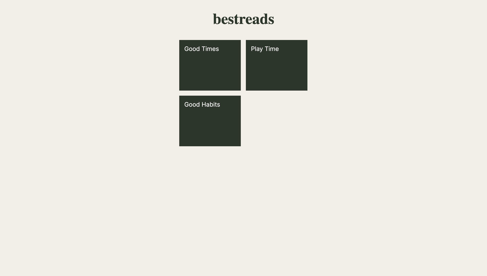

# BestReads

## Description

BestReads is a web application that allows users to view a list of books stored in a Firebase Realtime Database. Users can see the latest books added to the database in real-time.

## Features

- Displays a dynamic list of books retrieved from Firebase.
- Automatically updates the book list when new books are added.
- Responsive design for optimal viewing on mobile devices.

## Visual Design

Below is a visual representation of the website page:



## Getting Started

### Prerequisites

- A web browser to view the application.
- Basic knowledge of HTML, CSS, and JavaScript.

### Installation

1. Clone this repository to your local machine using:
   ```bash
   git clone https://github.com/BhoomiGohil/javascript-scrimba-learn-javascript-build-a-mobile-app-book-list.git
   ```
2. **Navigate to the project directory:**

```bash
cd javascript-scrimba-learn-javascript-build-a-mobile-app-book-list
```

3. **Open the `index.html` file in your web browser.**

```bash
open index.html
```

OR

3. **Open the project using Live Server:**

If you're using Visual Studio Code, install the Live Server extension.
Click on the "Go Live" option to run the project.

**Note:** This project requires a Firebase Database to store and retrieve data. Please set up a Firebase project and update the `databaseURL` in the JavaScript code accordingly.

## Usage

1. Once the application is open, you will see the title "BestReads" and a list of books (if available).
2. The book list will update automatically when new entries are added to the Firebase database.

## Technologies Used

- **HTML**: Structure of the web application.
- **CSS**: Styling of the application (see `index.css` for styles).
- **JavaScript**: Functionality and interaction with Firebase (see `index.js`).
- **Firebase**: Backend service for storing and retrieving book data.

## Resources

Feel free to explore the code. Happy coding!
